    

  

  

  

<body>

<h3 align="center">  Developer From India</h3>  

<h3 align="left">
  
</h3>
 &nbsp;&nbsp;

<h3 align="left">Connect with me:</h3>

  
  
  
  

#  🏄‍♂️ Abinash Sharma
 

  

# 💫 About Me:

- 🍁I love to explore new technologies to refine my skills and contribute to interactive projects.
- 🌟 My journey into coding began with a curiosity to create, automate, and solve real life problems
  
🔧 I'm currently working on: Learning Cloud Technology, AI agent and engineering and Python  for my upcoming projects and enhancing my portfolio  and AI-powered tools.  🤝I'm looking to collaborate on: AI-Cloud driven projects, Python development , and open-source contributions related to any  real time application.  ❓I'm looking for help with: Collaborating to any scalable project, improving performance in apps,refining and designing the app.  📚 I'm currently learning: Cloud Technology , DSA for competitive coding,Python with Machine learning, AI Engineering ,cloud DevOps practices (CI/CD, Docker, etc.) and Back-end.  ❓Ask me about: Tech Ideas, Myself, content creation, or building end-to-end projects from scratch, Collaboration, Tech Support.  🎉 Fun fact: I love building projects that combine creativity and automation—if it solves a real problem, I’m all in!  

---

# 💻 My favorite tools and technologies

<table align="center">
  <tr>
    <td align="center" width="96">
      
       Python
    </td>
    <td align="center" width="96">
        
       JavaScript
    </td>
    <td align="center" width="96">
        
       Webpack
    </td>
    <td align="center" width="96">
        
       MySQL
    </td>
    <td align="center" width="96">
        
       TypeScript
    </td>
    <td align="center" width="96">
        
       Google Cloud Platform
    </td>
            <td align="center" width="96">
        
       C
    </td>
  </tr>
  <tr>
  <td align="center" width="96">
        
       Django
    <td align="center" width="96">
        
       Github
    </td>
    <td align="center" width="96"> 
        
       Git
    </td>
    <td align="center"  width="96">
        
       HTML5
    </td>
    <td align="center" width="96">
        
       CSS
    </td>
    <td align="center"  width="96">
        
       Windows
    </td>
                  <td align="center" width="96">
        
       Linux
    </td>
  </tr>
 <tr>
      <td align="center" width="96">
        
       MongoDB
    </td>
            <td align="center" width="96">
        
       VsCode
    </td>
              <td align="center" width="96">
        
       WordPress
    </td>
              <td align="center" width="96">
        
       Unity
    </td>
              <td align="center" width="96">
        
       Postman
    </td>
              <td align="center" width="96">
        
       AR/VR
    </td>
      <td align="center" width="96">
        
       Gitlab
    </td>
 </tr>
</table>
  

---

# 📊 GitHub Stats:

   
  
   

  

 

  

## 🏆 GitHub Trophies

  

<!--### 🔝 Top Contributed Repo-->
<!---->

 

  

 
<h2>📺 Latest YouTube Videos</h2>

 ---

<!-- BEGIN YOUTUBE-CARDS -->

<!-- END YOUTUBE-CARDS -->
  

---
   

       
       

  <!-- Stylish Static Follow Button -->
  

---

### ✍️ Random Dev Quote

---

---

## 🏅 Certifications & Badges

<!-- CREDLY_BADGES_START -->

                    

<!-- CREDLY_BADGES_END -->

---

  

  ## 💰 Buy Me a Coffee ☕ 👇🏻
 

  
